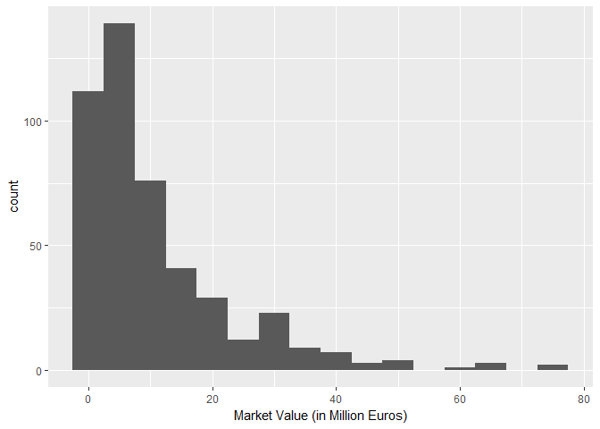
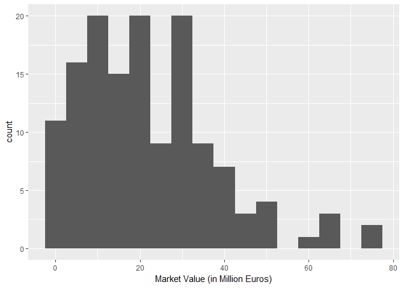
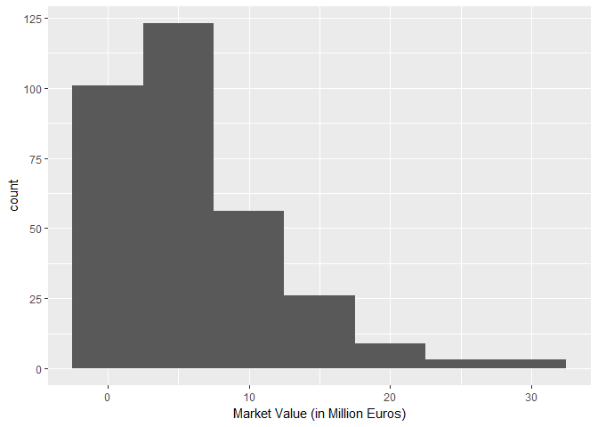
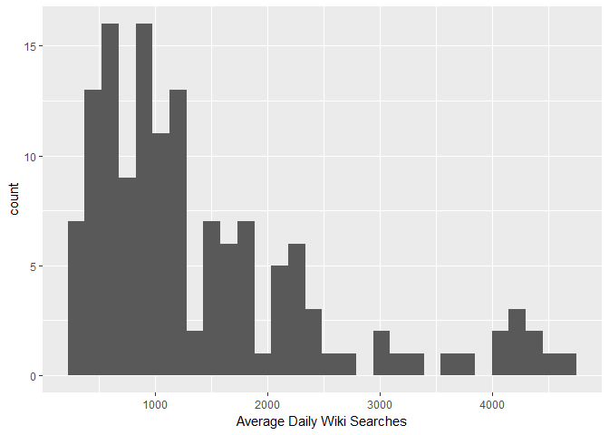
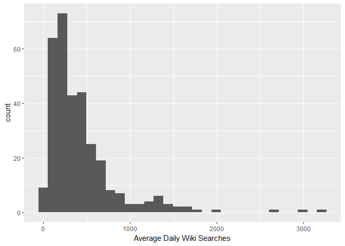

An Analysis of the English Premier League - Players and Teams 2016/2017
================

Exploring the Dataset
=====================

This dataset contains information for 461 players of the English Premier League, participating in 2016/17. This is still incomplete, as the transfer window is open. The data was scraped from TransferMrkt.com and Fantasy Premier League predominantly. To see the scraping, click [here](https://github.com/shubham-maurya/epl-data-scraping)

The head of the data looks like this -

``` r
head(df)
```

    ##                name    club age position position_cat market_value
    ## 1    Alexis Sanchez Arsenal  28       LW            1           65
    ## 2        Mesut Ozil Arsenal  28       AM            1           50
    ## 3         Petr Cech Arsenal  35       GK            4            7
    ## 4      Theo Walcott Arsenal  28       RW            1           20
    ## 5 Laurent Koscielny Arsenal  31       CB            3           22
    ## 6   Hector Bellerin Arsenal  22       RB            3           30
    ##   page_views fpl_value fpl_sel fpl_points region    nationality
    ## 1       4329      12.0  17.10%        264      3          Chile
    ## 2       4395       9.5   5.60%        167      2        Germany
    ## 3       1529       5.5   5.90%        134      2 Czech Republic
    ## 4       2393       7.5   1.50%        122      1        England
    ## 5        912       6.0   0.70%        121      2         France
    ## 6       1675       6.0  13.70%        119      2          Spain
    ##   new_foreign age_cat club_id big_club
    ## 1           0       4       1        1
    ## 2           0       4       1        1
    ## 3           0       6       1        1
    ## 4           0       4       1        1
    ## 5           0       4       1        1
    ## 6           0       2       1        1

What I'm trying to build
========================

-   A regression model that explains a player's transfer value
-   Estimating the size of the EPL's impact on popularity of players who've been signed from abroad
-   Do a comparative analysis of the Top 6 vs other teams
-   Estimate the (inverse) English premium

But first, some nice and simple exploratory analysis.

How are Market Values Distributed?
==================================

One would expect the distribution to be long-tailed on the right : Lots of cheap players, with much fewer quality players.

 Clearly, the majority of players are valued under 10 million euros.

Top 6 (Yes, Tottenham too.)
---------------------------



Outside Top 6
-------------



That gives us valuable information - the top 6 have a very different distribution as compared to the other clubs. (Okay, I'm going to clarify this right here - Top 6 is Manchester United, Tottenham, Manchester City, Arsenal, Chelsea, Liverpool) (in no particular order - okay fine. In the order I hope the 17/18 season finishes.)

Distribution of Popularity
==========================

I've also scraped the popularity of individual players. While this is no easy task given the lack of objectivity of what 'popular' means, I decided to go with a classic. Number of Wikipedia searches. While I admit this is not perfect, I think it suffers less than Twitter and Facebook data - several players don't have an account, they aren't active on social media, and so on. A count of news mentions was interesting, but I couldn't find the appropriate data.

Wikipedia searches, in my mind, seems a passable choice. It is not prone to influence by newspapers and player's pushing their profile (see Pogba). Some players just have more interesting stories than others, but on the whole, I think it's safe to assume that Wikipedia reflects a player's popularity.

Now regarding the daterange for the searches - this was a bit of a headache. THe data archive only dated back to 2015. Anyway, I definitely wanted to avoid May - August because of the transfer speculation. I settled on using *average daily searches* from August 1, 2016 to May 1, 2017, giving the summer transfer window a miss. It would have been ideal to ignore the winter window as well, but there was no way to do so easily. Since it's a relatively quiet window, I decided to allow that (minimal) bias.

Now let's lok at the histograms of popularity -

    ## `stat_bin()` using `bins = 30`. Pick better value with `binwidth`.


Top 6
-----

    ## `stat_bin()` using `bins = 30`. Pick better value with `binwidth`.



Outside Top 6
-------------

    ## `stat_bin()` using `bins = 30`. Pick better value with `binwidth`.



Herein lies my motivation for this project. There seems to be some correlation between market value and popularity, atleast at a highly-aggregated level like this. I think it's worth diving deeper into the data, to see if a decent model can be built. That'll be the focus of the work.
